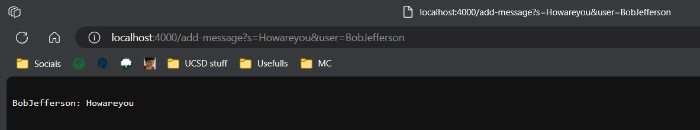
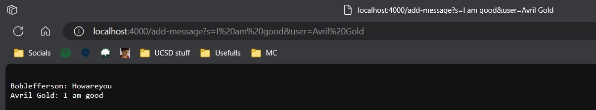

# Part 1:

## Code for ChatServer:

```
import java.io.IOException;
import java.net.URI;

class Handler implements URLHandler {
    // The String value that will be added upon through
    // various requests.
    String str = "";

    public String handleRequest(URI url) {
        if (url.getPath().equals("/")) {
            return String.format(str);
        } else {
            if (url.getPath().contains("/add-message")) {
                String[] parameters = url.getQuery().split("=");
                if (parameters[0].equals("s")) {
                    if (parameters[1].contains("user")) {
                        if (parameters[1].contains("&")) {
                            String[] middleString = parameters[1].split("&");
                            str += "\n" + parameters[2] + ": " + middleString[0];
                            return String.format(str);
                        }
                        return "No '&' symbol to separate s and user";
                    }
                    return "No user definedS";

                }
                return "No string defined";
            }
            return "404 Not Found!";
        }
    }
}

class ChatServer {
    public static void main(String[] args) throws IOException {
        if(args.length == 0){
            System.out.println("Missing port number! Try any number between 1024 to 49151");
            return;
        }

        int port = Integer.parseInt(args[0]);

        Server.start(port, new Handler());
    }
}
```

## Screenshots of adding messages:



The `handleRequest` method from the `Handler` class is called when the URL is input. There are many layers of arguments for the request. The first layer checks if `\add-message` is a valid argument. After that we check if an `s` is contained right after that. Then we check if `user` and `&` are located in the appropriate places. Any failure of these checks results in an error message being printed out. Only after all the arguments have been verified, the field `str` adds on to itself the `<user>: <s>`. And it prints. `str` is a `String` field created and initiated to an empty string value before the method `handleRequest` is called. No other fields or values like `url` is altered. 




The same applies here. `handleRequest` is called and and field `str` still contains the previous value of `BobJefferson: Howareyou`. So it will remain there until the server gets taken down or restarts. Arguments for `\add-message` gets checked, then `s` and `user` and `&`. After all relevant checks are verified, field `str` adds a line break `\n` before adding the `<user>: <s>` part. No other fields or values like `url` is altered. 
