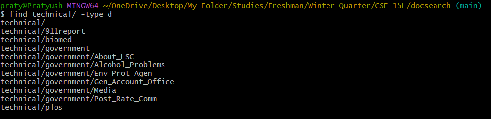

# Part 1

## Failure Inducing Input

```java
@Test
public void testReversedEven() {
  int[] input1 = {1, 2};
  assertArrayEquals(new int[]{2, 1}, ArrayExamples.reversed(input1));
}
```

## Non-failure Inducing Input

```java
@Test
public void testReversedEmpty() {
  int[] input1 = { };
  assertArrayEquals(new int[]{ }, ArrayExamples.reversed(input1));
}
```

## Output of JUnit


## Before Code

```java
static int[] reversed(int[] arr) {
    int[] newArray = new int[arr.length];
    for(int i = 0; i < arr.length; i += 1) {
      arr[i] = newArray[arr.length - i - 1];
    }
    return arr;
  }
```

## After Code

```java
static int[] reversed(int[] arr) {
    int[] newArray = new int[arr.length];
    for(int i = 0; i < arr.length; i += 1) {
      newArray[i] = arr[arr.length - i - 1];
    }
 return newArray;
}
```

This code fixes the error as the previous code switched adding to the `newArray` variable instead of `arr` variable. It also incorrectly returned the old `arr`, instead of the `newArray` variable.

# Part 2

We'll be looking at the `find` command here. `find` recursively searches the specified directory and prints all files and directories when no modifier is applied.

## `find <directory> -type <type>` 

Inputing `f` for `<type>` recursively finds and returns only files, not directories.


Since there are many files in `technical\`, many files are returned. This is a good way to gather the total number of files used in a program for many further arithmatic operations, or additional `find` or `grep` commands.

---

Inputing `d` for `<type>` recursively finds and returns only directories, not files.



There aren't as many files are there just directories, so there aren't many values returned. This is useful for checking how many folders there are and where they are located from a high level view. As the returned value is automatically sorted, it is easy to see where each folder is in case you forgot.

## `find <directory> -name <pattern>`

Inputing a pattern to search for in `<pattern>` recursively searches the input directory for any file or directory that matches the pattern.


Inputing a specified pattern to `<pattern>` only returns files that match that pattern exactly. In this case, the pattern was `chapter-1.txt`, so it only returns that. This is a good way to search for a known file or directory quickly.

---

However, inputting a `*` within the pattern, changes things:


In this case, `pattern` is `"chapter-*"`. `*` in programming generally means everything or all. Here, the file command is searching for all files or directories who's name begins with the pattern `"chapter-"`. This is a really good way for you to search for any file or directory if you remember only a part of the name, or to search for specific file extentions.

## `find <directory> -exec <command> {} \`

`-exec` executes the specified command on each file. For example:


In this case the command was `head` which prints the first 10 lines of the file. So the command first finds the files matching the name `chapter-*`, which in this case is all the 9/11 reports. Then for each file that it finds, it executes the command head. This is useful to get a brief overview of all all the files in a directory or in a specified.

---

Here's an example with delete:


Here, `<command>` is `rm -i` asks for input in the form of case insensitive (y/n) for deletion. The find command simply finds which files to execute the command on once again. This is useful if you want to delete directories but want to know which files in specific to delete or not. 

## `find <directory> -`