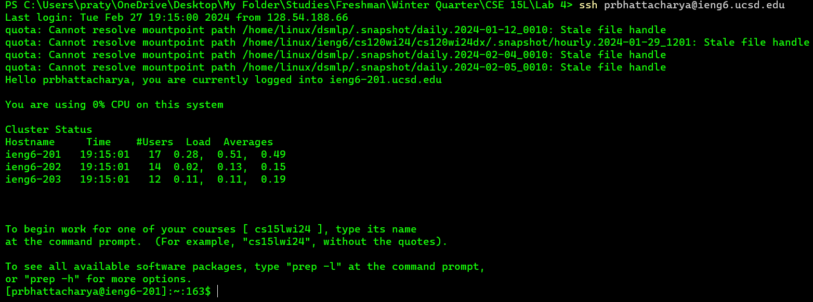
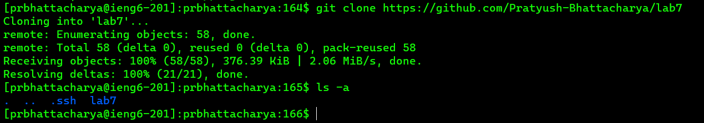
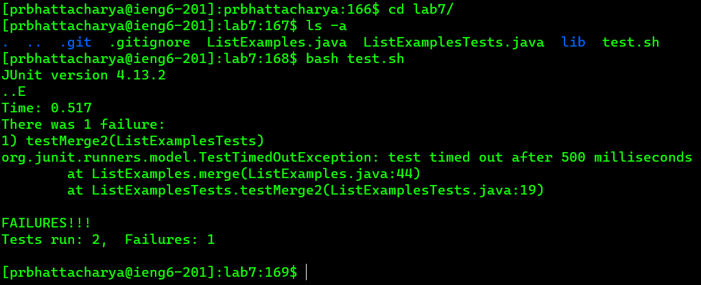
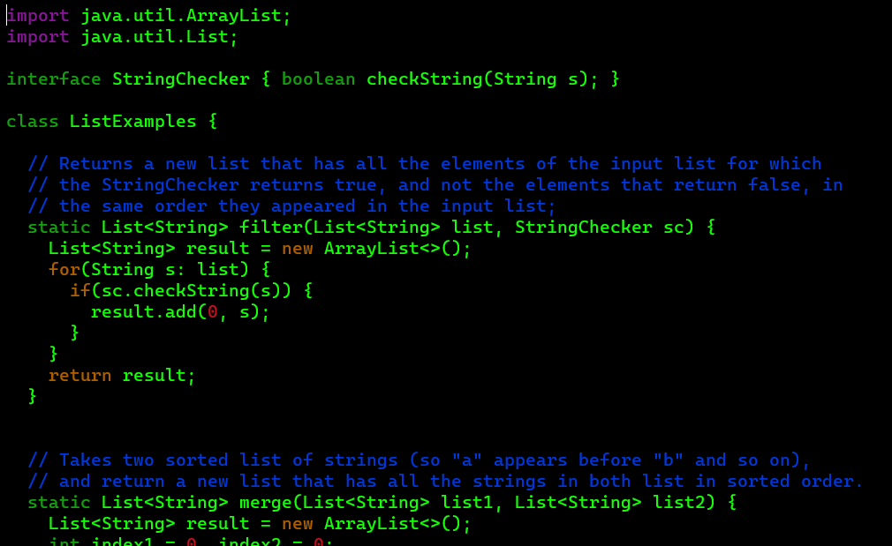
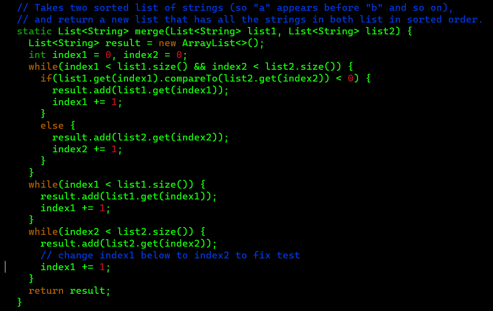
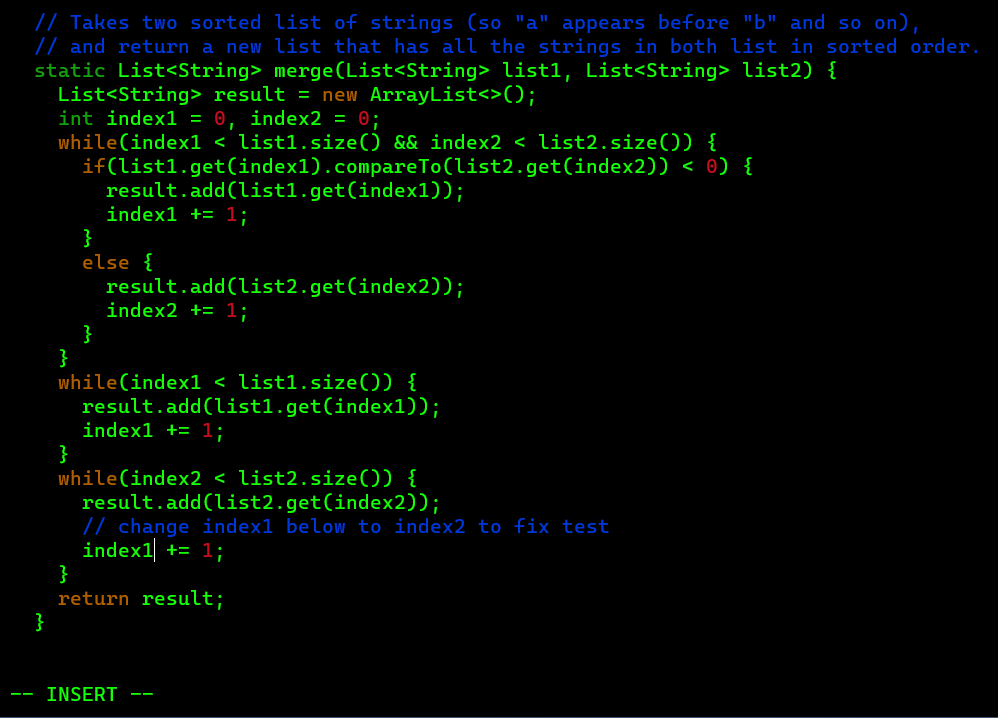
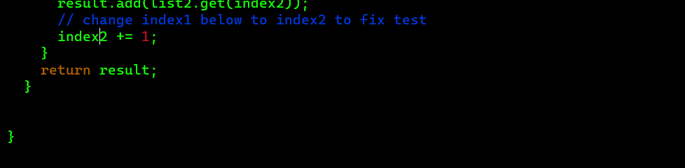
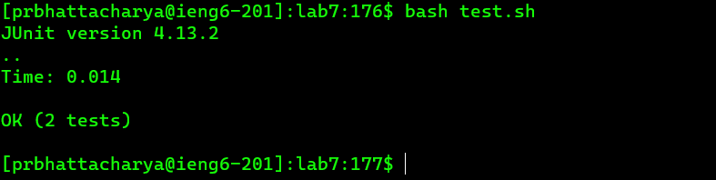
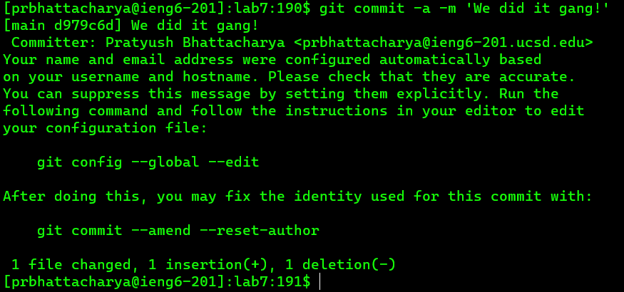
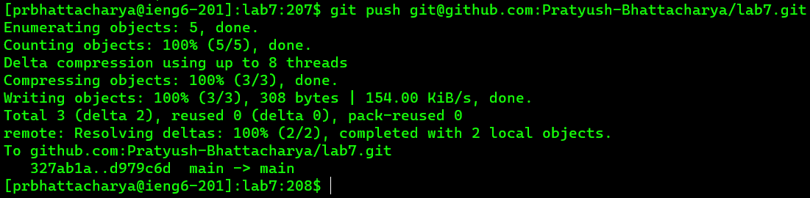

# Example of fast `vim` usage!

## Step 1: Log into ieng6:

Keys pressed: `<Ctrl + r>` + `s` + `<enter>`. `<Ctrl + r>` reverse searches your history to search for past instances of commands in the search query. In this case, the command we're trying to look for is `ssh`, which begins with `s`. As soon as I type in even one 's', the autofill already inputs the command in without having to press `<tab>`. Pressing enter exits the reverse search and submits the command into the terminal, logging me into ieng6.

Keys pressed: `Ctrl + r>` + `cs` + `<enter>`. The same is done here to log into my course-specific account.

## Step 2: Cloning the git repository:

Keys pressed: `git clone` + `Ctrl + V`. This works in the Windows terminal as it pasted the pre-copied Github URL: https://github.com/Pratyush-Bhattacharya/lab7. The `ls -a` command simply displays all directories and files within this directory including hidden directories. 

## Step 3: Running the tests:

Keys pressed: `cd l` + `<tab><enter>`. `ls -a`. `bash t` + `<tab><enter>`. I first change the directory to `lab7` using a tab autofill. Then i display everything within that directory with `ls -a`. Then I run the bash script using a tab autofill of `test.sh` as well. Out of the two tests run, one seems to have failed.

## Step 4: Fixing the error:

The error was found in `testMerge2` in `ListExampleTests.java`. Something is wrong with the `merge` method in `ListExamples.java`. 

Keys pressed: `vim L` + `<tab>` + `.j`+ `<tab><enter>`. This uses tab autocomplete to enter the vim of `ListExamples.java`. Now, we can make some changes in the file by scrolling down to the `merge` method using a series of `j` presses. In Vim, `j` is a motion that moves the cursor down 1 line when in normal mode.

Keys pressed: `j` × 44 (or to line 44). `j` moves the cursor down one line at a time. The change we need to make is over here in line 44. So let's change it. 

Keys pressed: `ea`. `ea` moves the cursor position to the end of the next word and switches to insert mode. `e` actually moves the cursor to the end of the next word *excluding* the last character, but adding `a` means append. Append switches to insert mode at the end of the current word, no matter where the cursor is, so even after `e` moves the cursor to the second last character, which is "x", `a` moves the cursor to the end of the word and switches to insert mode, visible at the bottom of the vim tab. Now in insert mode, we can make the necessary changes.

Keys pressed: `<backspace>` + `2` + `<escape>`. Now in insert mode, we can easily delete the 1 at the end and change it to a 2, then hit `<escape>` to switch back to normal mode. With the changes done, let's rerun our bash script to see if the test passes!

## Step 5: Rerun the tests:

This may seem unnecessarily difficult, but saving and quitting out of vim is pretty difficult! The keys pressed to return to the terminal are: `:wq`. `wq` stands for write and quit, which is the same as save and quit. Now that the hardest step is out of the way, let's rerun our bash script!

Keys pressed: `<up><up><enter>`. `<up>` goes back through your command history. In this case, I last used the `bash test.sh` command two commands ago, before my `vim` command. I hit enter to submit and it passed with no flaws.

## Step 6: Commiting & pushing to Github:

Keys pressed: `git commit -a -m 'We did it gang!`. `git commit` commits the changes to add to Github. The `-a` adds all modified files to the commit automatically. And `-m <message>` submits a message to go along with the commit. Every commit must come with a message for logging purposes.

Keys pressed: `git push` + `<Ctrl + V>` . We now push to upload all changes to origin, Github. Now our changes are visible on Github!

And we're done!
