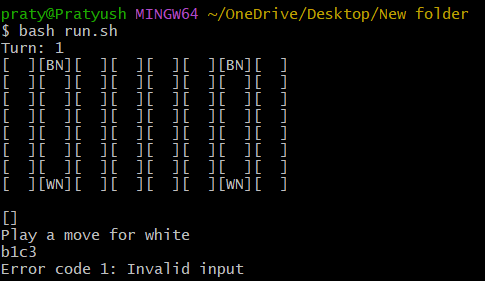
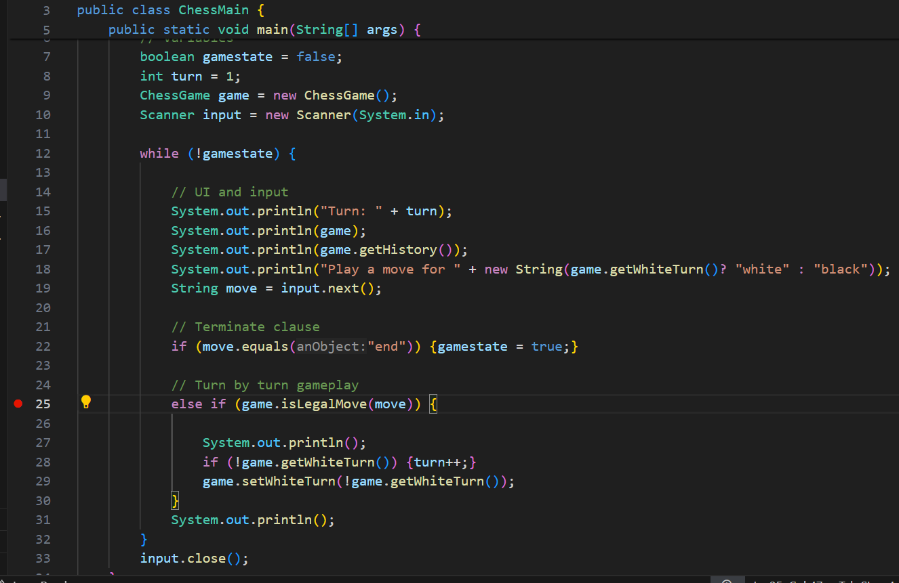
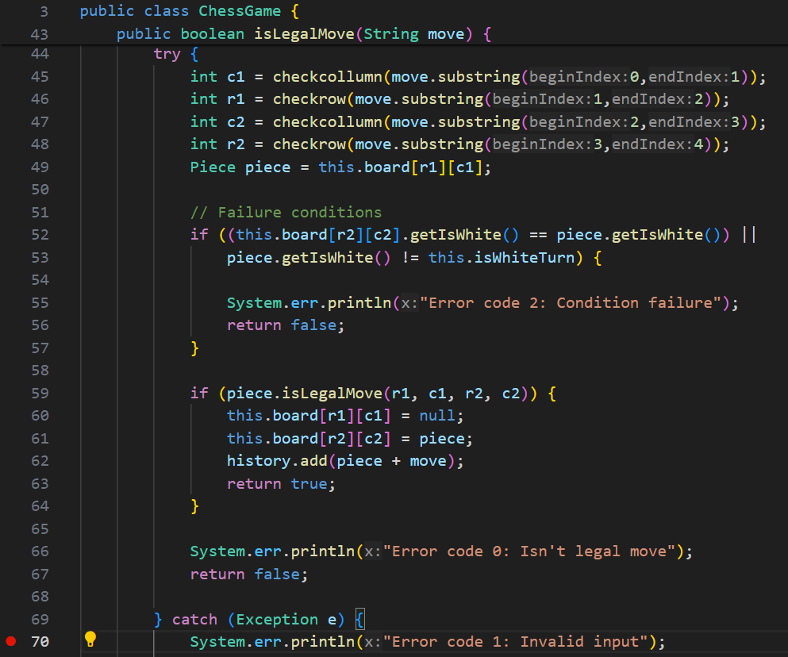
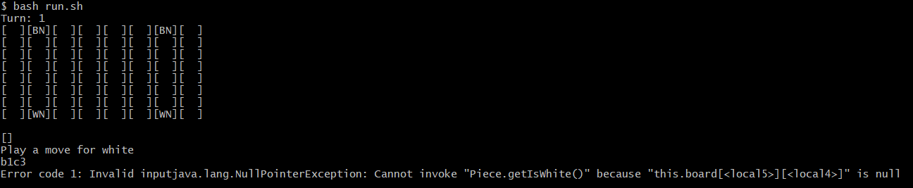
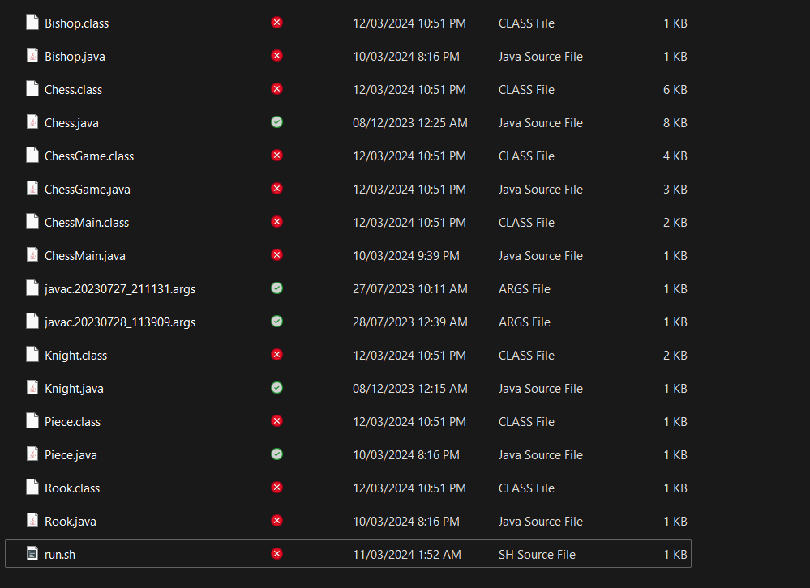

# Debugging Scenario

## Student's inciting post

A student posted a question on EdStem:

> Hey im struggling with a problem on my chess code. My input for moving a piece should come in the form: (starting collumn)(starting row)(ending collumn)(ending row). e.g: a1a7. Where a1 would be the rook in the corner as it tries to move to a7, the second last square before the end of the collumn. However, my code isn't working here:  This should ideally move the white night on b1 to c3, however my own code throws an invalid input. The following screenshots are my main method, and any methods my main method would call:  It is important to note that the method in issue is the `else if (game.isLegalMove(move))` on line 25.  My guess is that that it's catching some exception from the `checkcollumn` and `checkrow` methods, but I can't find a reason why it would from the right input.

## TA response

>> Hey, thanks for sending your code in. It seems when you use the `try-catch` block in java, you catch all exceptions and don't throw any back. Try printing out the error with `System.out.println(e)` and see what exactly is causing the error. Also, java can't check a 2D array table without checking if its `null` first. I believe the error comes from line 52 as that `if` statement will throw a `nullPointerException`. You should instead first check `if (this.board[r2][c2] =! null)` then use and statements `&&` to check further conditions.

## Student's response back

>>> Thank you for helping me! I was able to check what the error was and you were correct.  I checked the code and corrected it and it ran sucessfully! Turns out if the space in a 2D array is null, you must check that it is not null before checking any methods associated with that space's object.

## Extra information



run.sh:

```bash
set -e

javac *.java

java ChessMain.java
```

ChessGame.java:

```java
import java.util.ArrayList;

public class ChessGame {

    // Instance Variables
    private Piece board[][];
    private ArrayList<String> history = new ArrayList<String>();
    private boolean isWhiteTurn;

    // Constructor
    public ChessGame() {

        this.board = new Piece[8][8]; // Board setup
        this.isWhiteTurn = true;

        // Knights
        this.board[0][1] = new Knight(false);
		this.board[0][6] = new Knight(false);
        this.board[7][1] = new Knight(true);
		this.board[7][6] = new Knight(true);

    }

    public String toString() {

        String boardDisplayString = new String();

        for (int i = 0; i < 8; i++) {
            for (int j = 0; j < 8; j++) {
                if (this.board[i][j] == null) {
					boardDisplayString += "[  ]";
				} else {
					boardDisplayString += "[" + this.board[i][j] + "]";
				}
            }
            boardDisplayString += "\n";
        }
        
        return boardDisplayString;
        
    }

    public boolean isLegalMove(String move) {
		try {
			int c1 = checkcollumn(move.substring(0,1));
			int r1 = checkrow(move.substring(1,2));
			int c2 = checkcollumn(move.substring(2,3));
			int r2 = checkrow(move.substring(3,4));
			Piece piece = this.board[r1][c1];

			// Failure conditions
			if ((this.board[r2][c2].getIsWhite() == piece.getIsWhite()) || 
				piece.getIsWhite() != this.isWhiteTurn) {

				System.err.println("Error code 2: Condition failure");
				return false;
			}
				
            if (piece.isLegalMove(r1, c1, r2, c2)) {
				this.board[r1][c1] = null;
				this.board[r2][c2] = piece;
				history.add(piece + move);
				return true;
			}
			
			System.err.println("Error code 0: Isn't legal move");
			return false;

		} catch (Exception e) {
			System.err.println("Error code 1: Invalid input");
			return false;
		}
    }

    // Getters
    public ArrayList<String> getHistory() {return this.history;}
    public boolean getWhiteTurn() {return this.isWhiteTurn;}

	// Setters
	public void setWhiteTurn(boolean b) {this.isWhiteTurn = b;}

    // Translate collumn
	public static int checkcollumn(String collumn) {		
		switch (collumn) {
			case "a":
				return 0;
			case "b":
				return 1;
			case "c":
				return 2;
			case "d":
				return 3;
			case "e":
				return 4;
			case "f":
				return 5;
			case "g":
				return 6;
			case "h":
				return 7;
			default:
				System.out.println("Null thrown in checkCollumn()");
				throw null;
		}		
	}
	
	// Translate row
	public static int checkrow(String row) {
		switch (row) {
			case "1":
				return 7;
			case "2":
				return 6;
			case "3":
				return 5;
			case "4":
				return 4;
			case "5":
				return 3;
			case "6":
				return 2;
			case "7":
				return 1;
			case "8":
				return 0;
			default:
				System.out.println("Null thrown in checkRow()");
				throw null;
		}		
	}
	
}
```

Piece.java

```java
public abstract class Piece {

    boolean isWhite;

    public Piece(boolean isWhite) {
        this.isWhite = isWhite;
    }

    public boolean getIsWhite() {
        return this.isWhite;
    }
    
    @Override
    public abstract String toString();

    public abstract boolean isLegalMove(int r1, int c1, int r2, int c2);
    
}
```

Knight.java
```java
public class Knight extends Piece {

    public Knight(boolean isWhite) {
        super(isWhite);
    }

    @Override
    public String toString() {
        return new String((this.isWhite)? "W" : "B") + "N";
    }

    @Override
    public boolean isLegalMove(int r1, int c1, int r2, int c2) {    
            return (r2 == r1 - 2 && (c2 == --c1 || c2 == ++c1)) || (c2 == c1 - 2 && (r2 == --r1 || r2 == ++r1)) || (r2 == r1 + 2 && (c2 == --c1 || c2 == ++c1)) || (c2 == c1 + 2 && (r2 == --r1 || r2 == ++r1));
    }
  
}
```

ChessMain.java:

```java
import java.util.Scanner;

public class ChessMain {
	
	public static void main(String[] args) {
		// Variables
		boolean gamestate = false;
		int turn = 1;
		ChessGame game = new ChessGame();
		Scanner input = new Scanner(System.in);

		while (!gamestate) {
			
			// UI and input
			System.out.println("Turn: " + turn);
			System.out.println(game);
			System.out.println(game.getHistory());
			System.out.println("Play a move for " + new String(game.getWhiteTurn()? "white" : "black"));
			String move = input.next();
				
			// Terminate clause
			if (move.equals("end")) {gamestate = true;}
			
			// Turn by turn gameplay
			else if (game.isLegalMove(move)) {
				
				System.out.println();
				if (!game.getWhiteTurn()) {turn++;}
				game.setWhiteTurn(!game.getWhiteTurn());
			}
			System.out.println();
		}
		input.close();
	}
}
```

# Reflection

In this course I learned a lot about coding and the greater computer science subject. Learning how to use bash scripts was probably the most useful thing I'll ever use as the code is simple and very versitile. The posibilities with bash are something endless. I personally found checking different types of errors in bash to be particularly cool. By the way, the above chess game was an unfinished project I worked on in high school!